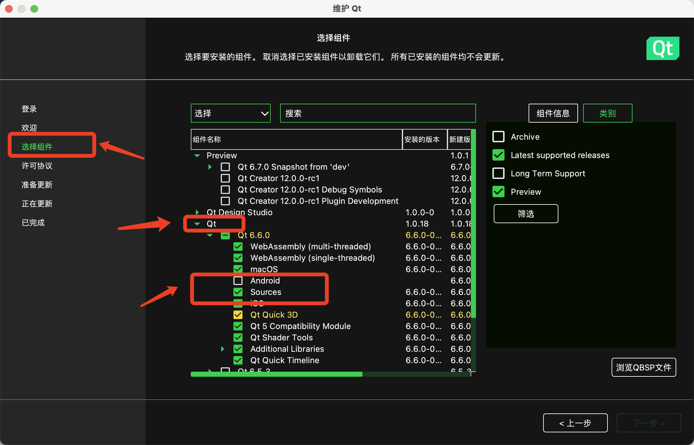
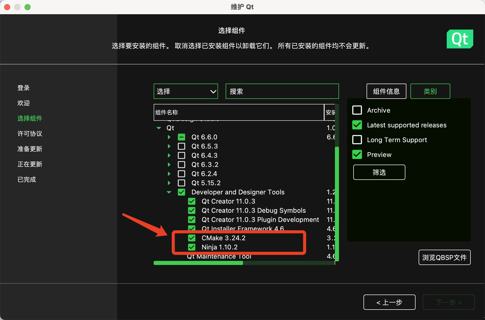

> - 环境配置：
>
>   - 电脑配置：Mac M1 版本: 
>
>   - QT版本： Qt6.6.0
>
>     - 所在目录  /Users/myName/Qt
>
>   - 必须使用QT维护工具 MaintenanceTool 来下载源码
>
>   - 软件环境：
>
>     - 最新版 Xcode 15  
>
>     - 终端 hoMyZsh (添加配置 ~/.zshrc ):
>   
>       - ```bash
>         # 需要添加如下配置
>         export PATH="/opt/homebrew/opt/mysql/bin:$PATH"
>         export LDFLAGS="-L/opt/homebrew/opt/mysql/lib"
>         export CPPFLAGS="-I/opt/homebrew/opt/mysql/include"
>         
>         #qt下的 cmake
>         export QTDIR="/Users/myName/Qt/6.6.0/macos"
>         export QT_DIR=$QTDIR
>         export QT6_DIR=$QTDIR
>         export CMAKE_PATH="/Users/myName/Qt/Tools/CMake/CMake.app/Contents/bin"
>         export NINJA_PATH="/Users/myName/Qt/Tools/Ninja"
>         export PATH=$PATH:$QTDIR/bin:$CMAKE_PATH:$NINJA_PATH
>         ```


1、使用 brew 安装mysql

```bash
$ brew install  mysql mysql-client

# 初始化brew 安装的mysql 
$ mysql_secure_installation

# 启动 mysql ，并添加到开机启动  , 可以使用 brew service stop mysql  来停止
$ brew service start mysql
```


2、使用QT维护工具 MaintenanceTool 来下载源码 和 Cmake 以及 Ninja





3、来到源码目录

```bash
$ cd /Users/myName/Qt/6.6.0/Src
```

4、开始配置

```bash
# 当前所在目录 /Users/myName/Qt/6.6.0/Src
$ ./configure -sql-mysql -- -DCMAKE_INCLUDE_PATH="/opt/homebrew/opt/mysql/include" \
		-DCMAKE_LIBRARY_PATH="/opt/homebrew/opt/mysql/lib"
```

5、准备编译

```bash
# 上一层所在目录 /Users/myName/Qt/6.6.0/Src
$ cd /Users/myName/Qt/6.6.0/macos/plugins/sqldrivers
```

6、创建编译目录

```bash
# 当前所在目录 /Users/myName/Qt/6.6.0/macos/plugins/sqldrivers
$ mkdir /Users/myName/Qt/6.6.0/macos/plugins/sqldrivers/build_sqldrivers
```

7、来到编译目录

```bash
# 上一层所在目录 /Users/myName/Qt/6.6.0/macos/plugins/sqldrivers
$ cd /Users/myName/Qt/6.6.0/macos/plugins/sqldrivers/build_sqldrivers
```

8、编译配置

```bash
# 当前所在目录 /Users/myName/Qt/6.6.0/macos/plugins/sqldrivers/build_sqldrivers
$ /Users/myName/Qt/6.6.0/macos/bin/qt-cmake -G Ninja \
		/Users/myName/Qt/6.6.0/Src/qtbase/src/plugins/sqldrivers \
		-DCMAKE_INSTALL_PREFIX=/Users/myName/Qt/6.6.0/macos \
		-DMySQL_INCLUDE_DIR="/opt/homebrew/opt/mysql/include" \
		-DMySQL_LIBRARY="/opt/homebrew/opt/mysql/lib/libmysqlclient.dylib" \
		-DCMAKE_OSX_ARCHITECTURES="arm64"
```

9、控制当前的编译版本为arm

```bash
# 当前所在目录 /Users/myName/Qt/6.6.0/macos/plugins/sqldrivers/build_sqldrivers
$ sed -i -e 's/-arch x86_64/-arch arm64/g'  \
		/Users/myName/Qt/6.6.0/macos/plugins/sqldrivers/build_sqldrivers/build.ninja
```

10、可能会出现找不到 `<mysql.h>` 头文件的错误，进行以下操作进行修复, 如果找得到就不需要进行如下操作

```bash
# 当前所在目录 /Users/myName/Qt/6.6.0/macos/plugins/sqldrivers/build_sqldrivers
# 修改一个cpp文件 , 将头文件替换成路径
$ sed -i -e 's/<mysql.h>/"\/opt\/homebrew\/opt\/mysql\/include\/mysql\/mysql.h"/g'  \
		/Users/myName/Qt/6.6.0/Src/qtbase/src/plugins/sqldrivers/mysql/qsql_mysql_p.h
```

11、编译

```bash
# 当前所在目录 /Users/myName/Qt/6.6.0/macos/plugins/sqldrivers/build_sqldrivers
$ cmake --build .
```

12、寻找编译出来的文件

```bash
# 当前所在目录 /Users/myName/Qt/6.6.0/macos/plugins/sqldrivers/build_sqldrivers
$ find /Users/myName/Qt/6.6.0/macos/plugins/sqldrivers/build_sqldrivers/ \
		-name "libqsqlmysql.dylib*"
```

13、将生成的编译文件libsqlmysql.dylib复制到sqldrivers文件夹中，即`/Users/myName/Qt/6.6.0/macos/plugins/sqldrivers/build_sqldrivers`。

```bash
# 当前所在目录 /Users/myName/Qt/6.6.0/macos/plugins/sqldrivers/build_sqldrivers
# 可用以下命令来快捷复制
$  find /Users/myName/Qt/6.6.0/macos/plugins/sqldrivers/build_sqldrivers/  \
			-name "libqsqlmysql.dylib*" \
      -exec cp -a {} /Users/myName/Qt/6.6.0/macos/plugins/sqldrivers/ \; 
```


结束
