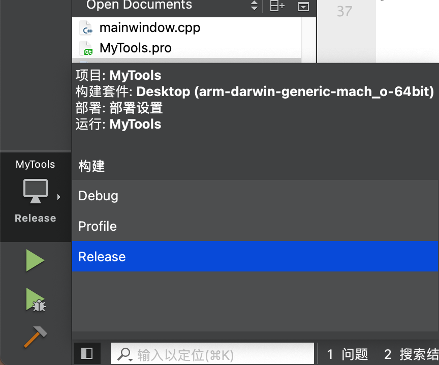

- 在Qt Creator 开发工具中，打开项目， 在底部选择 Release 构建出 App
- 
- 点击编辑， 项目名称右键， 选择 OpenTerminal With ,再点击 Build Environment.

- 在底部会出现终端界面，但是目前还在源代码目录下， 需要退到上一层目录。
  - `cd ..`
- 寻找  build-项目名称 (例如 MyTools) XXX-Release  的目录，并进入
  - 例如： `cd build-MyTools-Desktop_arm_darwin_generic_mach_o_64bit-Release `
- 执行打包命令： ` macdeployqt MyTools.app  -verbose=1 -dmg  ` 就会生成一个 MyTools.dmg 文件。   如果该文件已存在，那么就应该删除该文件后，再生成。
  - 如果 `MyTools.app` 不存在，那么可以执行 `macdeployqt MyTools.app` 来进行编译

