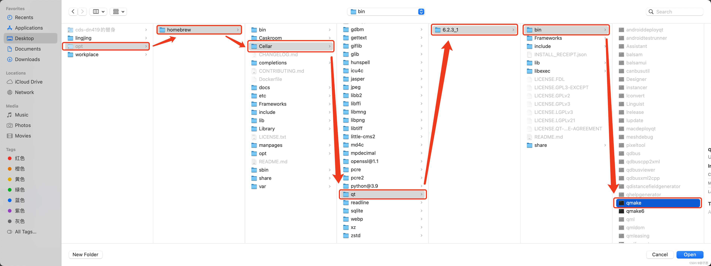

基于MacOS Ventura

## brew环境

```bash
# 需要 brew 环境， 自行安装
 # 安装网站	https://brew.sh/index_zh-cn
$ /bin/bash -c "$(curl -fsSL https://raw.githubusercontent.com/Homebrew/install/HEAD/install.sh)"
```

## 2、用brew安装qt

```cobol
brew install qt 
```

## 3、用brew安装qt-creator

```cobol
brew install qt-creator
```

## 4、执行完上述三条命令就可以打开qt界面了，但是创建不了工程，此时需要配置一下qt-kits


需要添加[qmake](https://so.csdn.net/so/search?q=qmake&spm=1001.2101.3001.7020)文件，问题来了，brew安装的文件需要去数据盘取，此时可以执行find命令找个qmake路径。find是全盘扫，需要一点点时间。

```cobol
sudo find / -name qmake
```

发现路径


此时去数据盘里找opt文件夹，双指同时点击桌面文件夹可弹出选项卡


但此时的opt文件夹是不可见的，需要跑两条命令。

```bash
$ defaults write com.apple.finder AppleShowAllFiles YES;

$ killall Finder /System/Library/CoreServices/Finder.app;
```

再打开访达就能看到了。


制作替身（我认知下替身应该是一个指针指向原始文件存放地址的一个东西

然后移动到你的用户文件夹下（也可以是桌面，任意qt-creator能访问到的地方



至此qt-kits里的qt-version就配置好了。


## 5、接下来配置qt-kits。

首先找到Desktop (arm-darwin-generic-mach_o-64bit)这一选项（其他应该也行


填入相应信息即可，点击确定，配置完毕。

